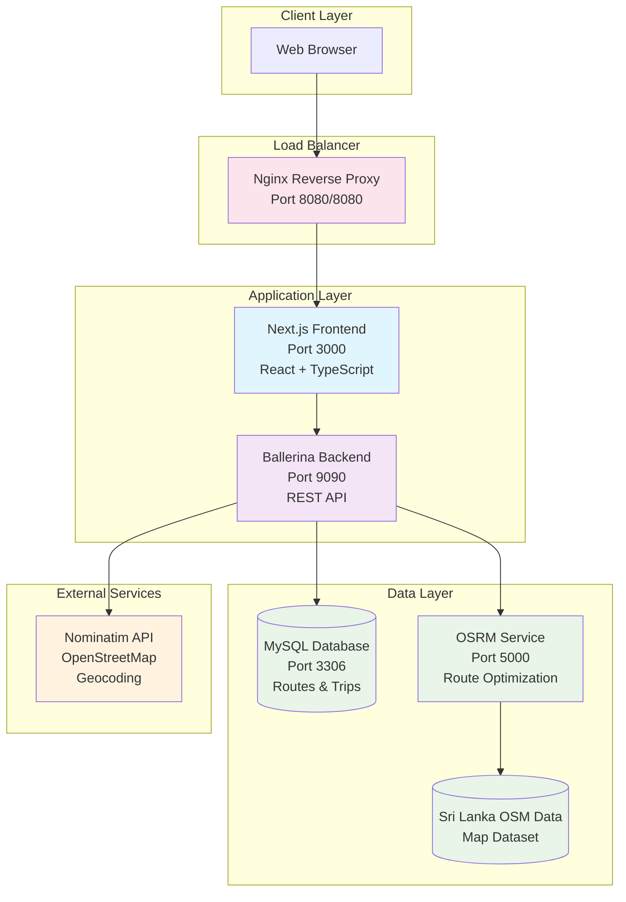
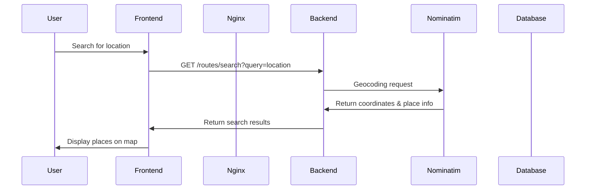
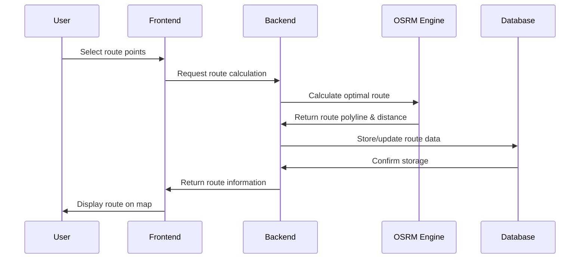

# Public Transport Tracker

A real-time public transport tracking system built with **Ballerina** as the core backend technology, Next.js frontend, and MySQL database, featuring live vehicle tracking, route optimization, and interactive mapping.

## 🏗️ Architecture Overview



## 🚀 Quick Start

### Development Mode

```bash
docker compose up --build
```

Access at: http://localhost:8080

### Production Mode

```bash
docker compose -f compose.production.yaml up --build
```

Access at: http://localhost:8080

## 📋 Prerequisites

- Docker & Docker Compose
- Environment variables (create `.env` file):
  ```bash
  MYSQL_ROOT_PASSWORD=your_secure_password
  ```

## 🏛️ System Components

### Frontend (Next.js + TypeScript)

- **Technology**: React 18, Next.js 14, TypeScript, Tailwind CSS
- **Features**:
  - Interactive maps with vehicle tracking
  - Real-time route search and visualization
  - Responsive design for mobile and desktop
  - Server-side rendering (SSR) for better performance
- **Authentication**: NextAuth.js integration
- **State Management**: React Query for server state management

### Backend (Ballerina)

**Ballerina** is the heart of this transportation system, providing a powerful, cloud-native programming language specifically designed for integration and API development.

#### **Why Ballerina?**

- **Integration-First Language**: Built specifically for connecting systems, APIs, and services
- **Network-Aware Type System**: Native support for HTTP, JSON, SQL, and other network protocols
- **Graphical & Textual Syntax**: Visual representation of service interactions
- **Cloud-Native**: Designed for microservices and containerized deployments
- **Error Handling**: Robust error handling with built-in resilience patterns

#### **Technology Stack**

- **Language**: Ballerina Swan Lake (Latest)
- **HTTP Server**: Built-in HTTP/1.1 and HTTP/2 support
- **Database**: MySQL connector with connection pooling
- **External Integrations**: HTTP client connectors for OSRM and Nominatim

#### **Service Architecture**

- **Microservice Design**: Lightweight, containerized service
- **External Service Integration**:
  - **Nominatim API**: Geocoding and place search
  - **OSRM Engine**: Route calculation and optimization
  - **MySQL Database**: Persistent data storage
- **Hot Reload**: Development mode with automatic recompilation
- **Production Ready**: Optimized builds with minimal resource footprint

### Database (MySQL)

- **Schema**:
  - `routes` table: Store route information with start/end points
  - `trips` table: Track real-time vehicle positions
- **Features**:
  - Geospatial data support for coordinates
  - Optimized queries for location-based searches
  - Data persistence with Docker volumes

### Routing Engine (OSRM)

- **Technology**: Open Source Routing Machine
- **Dataset**: Sri Lanka OpenStreetMap data
- **Features**:
  - Fast route calculation
  - Turn-by-turn directions
  - Distance and duration estimation

### Reverse Proxy (Nginx)

- **Purpose**: Load balancing and request routing
- **Configuration**:
  - Routes `/compute/*` to backend service
  - Routes all other requests to frontend
  - Handles CORS and security headers

## 🔄 Data Flow

### 1. Route Search Flow



### 2. Route Calculation Flow



## 🐳 Container Architecture

### Development Environment

- **Frontend**: Hot reload enabled, source code mounted
- **Backend**: Watch mode for automatic recompilation
- **Database**: Development data with volume persistence
- **Port Mapping**: 8080:80 (nginx), 3000, 9090, 3306, 5000

### Production Environment

- **Frontend**: Optimized build, no source mounting
- **Backend**: Production compilation
- **Database**: Production-ready configuration
- **Port Mapping**: 8080:80 (nginx), internal ports only

## 🔧 Configuration

### Environment Variables

| Variable                  | Description              | Default                          |
| ------------------------- | ------------------------ | -------------------------------- |
| `MYSQL_ROOT_PASSWORD`     | Database root password   | Required                         |
| `NEXT_PUBLIC_BACKEND_URL` | Frontend browser API URL | `http://localhost:8081/compute/` |
| `NODE_ENV`                | Environment mode         | `development`                    |

## 🗂️ Project Structure

```
public-transport-tracker/
├── frontend/                 # Next.js application
│   ├── app/                 # App router pages
│   ├── components/          # Reusable UI components
│   ├── lib/                 # Utilities and configurations
│   └── public/              # Static assets
├── backend/                 # Ballerina API service
│   ├── tracking_service.bal # Main service file
│   ├── database.bal         # Database configuration
│   └── types.bal           # Data type definitions
├── database/               # Database initialization
│   └── database_init.sql   # Schema and seed data
├── nginx/                  # Reverse proxy configuration
│   ├── dev/               # Development config
│   └── prod/              # Production config
├── compose.yaml           # Development Docker setup
└── compose.production.yaml # Production Docker setup
```
